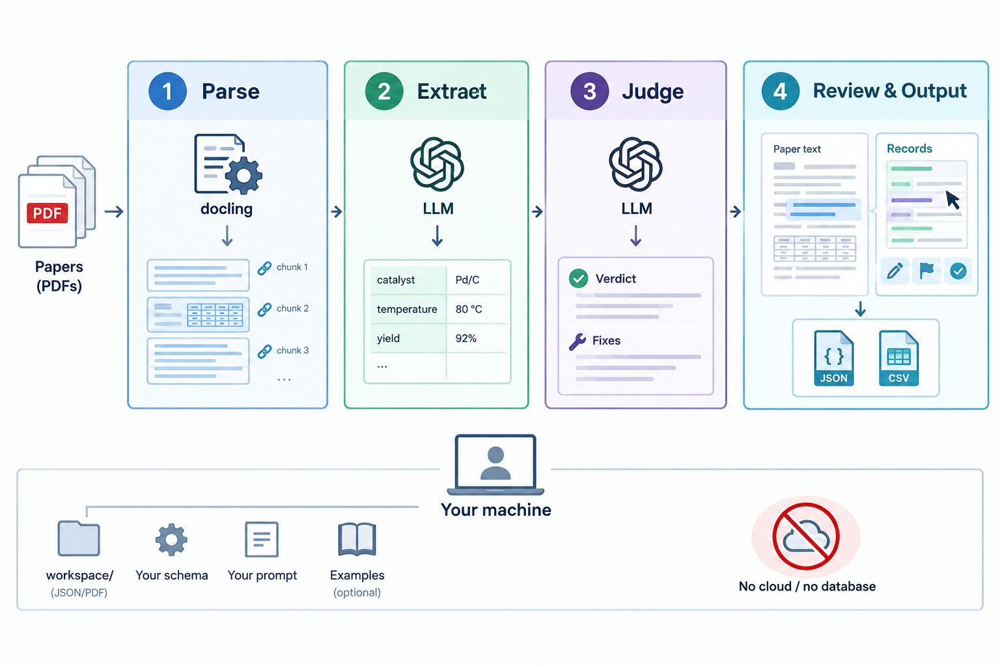

# Chemistry Data Extractor Toolkit

Turn a folder of papers into a structured dataset you can trust. One model reads each PDF and
fills a schema you define; a second model re-reads the paper and audits every record against it;
you review what is left with the source text beside you and the passage behind each value
highlighted. Everything runs on your own machine, and the schema, prompts and examples are
things you edit in the browser — so the same pipeline works on ionic liquids, palladium
catalysis or anything else without touching the code.



## Install

```bash
git clone https://github.com/Enkhnyam/chemistry-data-extractor-toolkit.git
cd chemistry-data-extractor-toolkit
uv sync
uv run uvicorn server.main:app
```

Open <http://localhost:8000>. The first `uv sync` downloads PyTorch and takes a few minutes
(~6 GB on disk) — that is docling, the PDF reader, and it is the only slow part.

Or with Docker, which needs neither Python nor the download on your machine:

```bash
docker compose up --build
```

Same address. The workspace lives in `./data/`, and anything you add — papers, records, API
keys — stays there between runs.

## Already cloned an older version?

`git pull` brings the demo, but two things do not follow automatically:

```bash
git pull
uv sync          # picks up new dependencies — without it model calls fail
```

And if you had already opened Settings, your workspace is no longer empty, so the demo is not
seeded into it — that rule exists so it can never overwrite your work. The getting-started guide
then offers **Load the demo**, which asks before replacing anything.

## What you see first

A finished project, not an empty form. The workspace is seeded with two open-access PET papers
that are already parsed, extracted and judged — 25 records, the judge's verdict on each, a full
report — so you can read the output before deciding whether the tool is worth setting up. No API
key is needed to look at any of it.

**The one thing you have to supply is an API key.** The schema, both prompts and the papers are
already in place; the app will not call a model without a key, and that is the only thing
standing between the demo and running it yourself. Settings → Models.

When you are ready to use your own papers, **Clear the demo and start my own project** empties
the workspace — papers, records and the demo's schema and prompts together, so nothing of the
PET example is left to be silently applied to your chemistry.

The demo lives in `demo/` and is copied in only when the workspace is empty, so it can never
overwrite your work or come back after you clear it. `demo/NOTICE.md` says which papers they are
and under what licence they are redistributed. To rebuild its records from the PDFs:

```bash
OPENAI_API_KEY=sk-... uv run python scripts/build_demo.py
```

## Using it

The app shows a checklist of what it still needs, and refuses to run until it has it. On a fresh
clone only the first item is outstanding.

**1. Add a model** — Settings → Models. A name, a model string (`gpt-4o-mini`,
`anthropic/claude-sonnet-4-5`, `ollama/llama3`, `azure/your-deployment`), and its API key. Add an
endpoint and API version only if your provider needs them; Azure does, most do not. If you are
pointing at an endpoint of your own, press **List models** rather than typing a name — it asks
the server what it actually serves, and the answer is often not what you would guess. **Test
connection** then proves the whole thing works. Extraction and judging pick their model
separately, so you can extract with one and audit with another.

**2. Define your schema** — Settings → Schema. *(the demo fills this in; replace it with your own)* The fields one record should have, with a
description of each. The model reads those descriptions, so say what you mean. Grey rows are an
example you can type over, keep, or delete.

**3. Write the extraction prompt** — in Settings, or from the Extract page. *(the demo fills this in too)* What to pull out of
each paper and what to skip. The box shows a real working prompt in grey as an illustration;
**Use the example** copies it in to adapt. Optionally add a worked example: one paper's text
paired with the records it should produce, which teaches conventions a prompt cannot.

**4. Parse** — drop in PDFs, or a whole folder. Each is split into text and table chunks. Leave
source tracking on and every record can cite the exact chunk a value came from.

**5. Extract** — one call per paper, run one at a time with live progress, a time estimate and a
running token count. You can leave the tab; it keeps going.

**6. Judge** — a second model re-reads each paper and checks every record, flagging fields and
proposing fixes. Write its rubric first, the same way as the prompt.

**7. Review** — the paper on the left, its records on the right. Click a record to shade the
chunks it cites. Click a field to find its value in the text, and again to jump to the next
match. Edit anything, or apply the judge's proposed fix. Each proposal is labelled with what it
would change, because some kinds are far more reliable than others.

**8. Report** — completeness by field, what the judge changed, the distribution of any field,
and CSV/JSON export of every record with its verdict and your notes.

## Notes

- Nothing is applied automatically. The judge is a tireless second reader, not an authority — in
  our own validation, 21 of 22 proposals to rename a substance turned out to be two acceptable
  names for the same compound rather than errors.
- Your data stays put: plain JSON and PDFs under `workspace/`, no database. The only things that
  leave the machine are calls to your LLM provider, and a one-time OCR model download on the
  first parse.
- API keys are written to a local `.env` and never sent back to the browser.
- The two demo PDFs are CC BY 4.0 and redistributed with attribution; everything else here is
  MIT. See `demo/NOTICE.md`.
- There is no authentication, so keep it on localhost.

Docker: `cp .env.example .env && docker compose up --build` (the build wants ~8 GB of RAM free).

Tests: `uv run python -m unittest discover -s tests`. For an end-to-end run against a fresh
clone, `uv run python scripts/overnight_check.py`.

## Licence

MIT — see [LICENSE](LICENSE). If you use it in published work, please cite it; see
[CITATION.cff](CITATION.cff).
