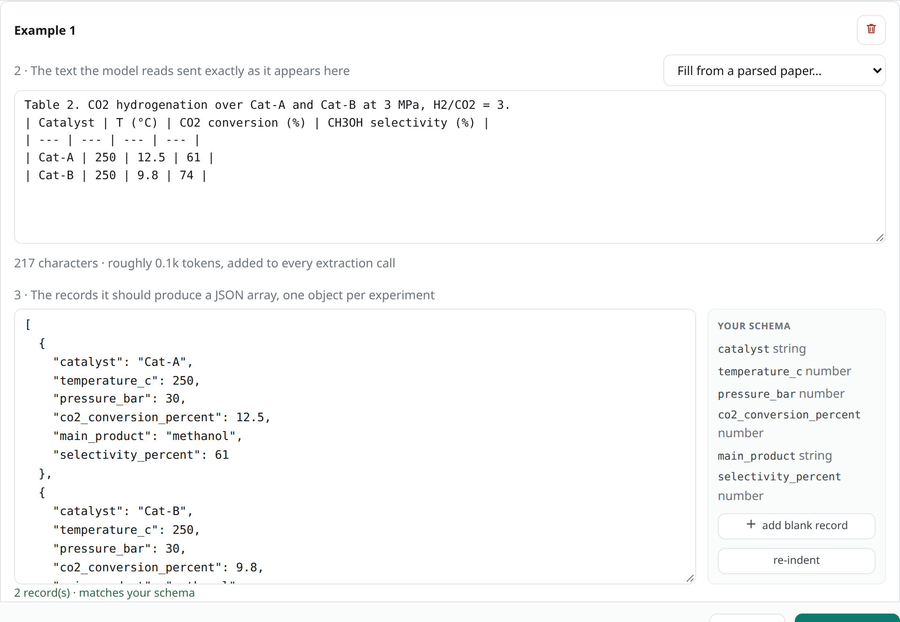

# Worked examples

A **worked example** is a short piece of a paper together with the records it should give.
The model sees it before every paper, so it learns your conventions from an example: how to
name a catalyst, which table rows count, how to fill in conditions from a footnote.

!!! info "Optional, but often worth it"
    Extraction works without examples. One good example often helps more than another
    paragraph of prompt. Use two or three at most: each one is sent with every paper.

## Write an example

Make the example typical of your papers, and use made-up names and numbers, so the model
can't copy answers from it. For the example papers:

=== "Browser"

    1. Click **Extract** at the top of the page.
    2. Next to **Worked examples**, click **Add**, and click **Add an example**.
    3. Under **The text the model reads**, paste a piece of a paper. You can also choose a
       paper under **Fill from a parsed paper** and cut it down.
    4. Under **The records it should produce**, write one record per experiment. Click
       **add blank record** to start one with your fields.
    5. Click **Save examples**.

    !!! success "You should see"
        

        **matches your schema** under the records means the field names are right.

=== "Python"

    ```python
    text = """Table 2. CO2 hydrogenation over Cat-A and Cat-B at 3 MPa, H2/CO2 = 3.
    | Catalyst | T (°C) | CO2 conversion (%) | CH3OH selectivity (%) |
    | --- | --- | --- | --- |
    | Cat-A | 250 | 12.5 | 61 |
    | Cat-B | 250 | 9.8 | 74 |"""

    records = [
        {"catalyst": "Cat-A", "temperature_c": 250, "pressure_bar": 30,
         "co2_conversion_percent": 12.5, "main_product": "methanol",
         "selectivity_percent": 61},
        {"catalyst": "Cat-B", "temperature_c": 250, "pressure_bar": 30,
         "co2_conversion_percent": 9.8, "main_product": "methanol",
         "selectivity_percent": 74},
    ]

    project.examples = [{"text": text, "records": records}]
    ```

    The records use your field names. Leave out a field, or write `None`, when the text
    doesn't give it.

!!! info "Copies of the example are removed"
    Now and then a model repeats the example's records in its answer for a real paper.
    file2records drops any record that matches an example record in every field, so made-up
    values never reach your dataset.

!!! tip "Show the hard cases"
    This example shows two conventions in one go: the pressure comes from the caption, not
    the table, and it's converted from MPa to bar. Pick the cases your prompt alone doesn't
    get right.

Continue with [Judge rubric](rubric.md).
