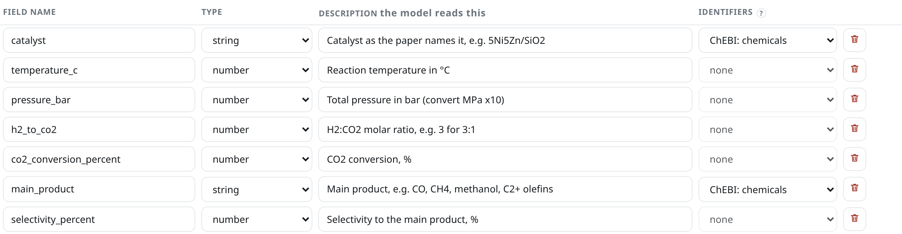
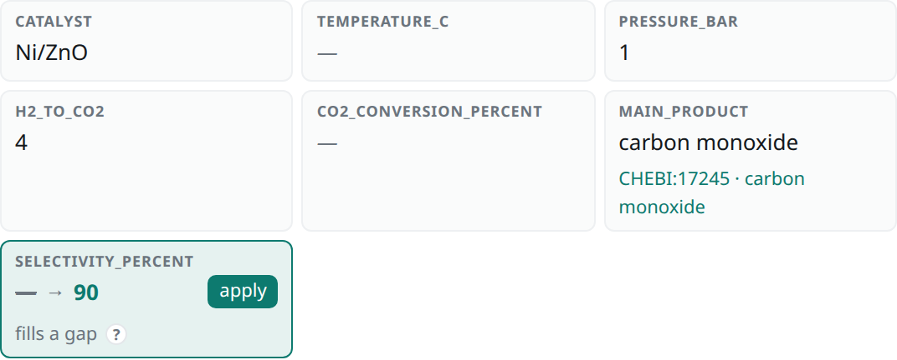

# Fields

A **record** is one row of your dataset, usually one experiment. The **fields** are its
columns. Each field has three parts:

Name
:   Lowercase, with underscores, such as `temperature_c`. It becomes the column name.

Type
:   `string` for text, `number` for decimals, `integer` for whole numbers, or `boolean` for
    yes or no.

Description
:   What to put in the field. The model reads it, so give the unit and how to convert.

For the example papers, use these six fields:

<!-- vale Google.Latin = NO -->
| Name | Type | Description |
|---|---|---|
| `catalyst` | string | Catalyst as the paper names it, e.g. 5Ni5Zn/SiO2 |
| `temperature_c` | number | Reaction temperature in °C |
| `pressure_bar` | number | Total pressure in bar; convert MPa by multiplying by 10 |
| `co2_conversion_percent` | number | CO2 conversion, % |
| `main_product` | string | Main product, e.g. CO, CH4, methanol |
| `selectivity_percent` | number | Selectivity to the main product, % |

## Set the fields

=== "Browser"

    1. Click **Settings**, and scroll to **Schema**.
    2. Click **Clear all** to remove the gray example rows.
    3. Click **Add field** six times, and fill in the rows from the table.
    4. Click **Save changes**.

    !!! success "You should see"
        

=== "Python"

    Write the fields as a dictionary: the name, then the type and the description.

    ```python
    project.schema = {
        "catalyst": ("string", "Catalyst as the paper names it, e.g. 5Ni5Zn/SiO2"),
        "temperature_c": ("number", "Reaction temperature in °C"),
        "pressure_bar": ("number", "Total pressure in bar; convert MPa by multiplying by 10"),
        "co2_conversion_percent": ("number", "CO2 conversion, %"),
        "main_product": ("string", "Main product, e.g. CO, CH4, methanol"),
        "selectivity_percent": ("number", "Selectivity to the main product, %"),
    }
    ```

    !!! success "To check"
        ```python
        print([field["name"] for field in project.schema])
        ```

        ```console
        ['catalyst', 'temperature_c', 'pressure_bar', 'co2_conversion_percent', 'main_product', 'selectivity_percent']
        ```

    ??? note "Other ways to write the fields"
        A text field can be just its description:
        `{"catalyst": "Catalyst as the paper names it"}`.

        If you use pydantic, a model class works too:

        ```python
        from pydantic import BaseModel, Field

        class Experiment(BaseModel):
            catalyst: str | None = Field(None, description="Catalyst as the paper names it")
            temperature_c: float | None = Field(None, description="Reaction temperature in °C")

        project.schema = Experiment
        ```

        And a JSON file: `project.schema = "schema.json"`.
<!-- vale Google.Latin = YES -->

## Add identifiers for chemicals

A text field that names a chemical can also get the chemical's
[ChEBI](https://www.ebi.ac.uk/chebi/) identifier. Papers write the same compound in different
ways, such as `CH4` and `methane`, and the identifier is the same for both, so you can group,
count, and combine records by compound.

=== "Browser"

    In **Settings → Schema**, choose **ChEBI: chemicals** under **Identifiers** for the
    field, and click **Save changes**. Only text fields can have identifiers.

    

=== "Python"

    ```python
    project.identifiers = {"main_product": "chebi"}
    ```

The export then has three more columns after the field: the identifier, the name it stands
for, and the other names the model gave for the value, separated by semicolons:

| `solvent` | `solvent_curie` | `solvent_curie_name` | `solvent_synonyms` |
|---|---|---|---|
| `EG` | CHEBI:30742 | ethylene glycol | ethylene glycol; ethane-1,2-diol; 1,2-ethanediol |
| `ZnCl2` | CHEBI:49976 | zinc dichloride | zinc chloride; zinc(II) chloride |
| `[Bmim]Cl` | | | 1-butyl-3-methylimidazolium chloride; 1-butyl-3-methyl-1H-imidazol-3-ium chloride |

In **Review**, the identifier appears under the value and links to the compound's page:

{ width="560" }

!!! info "Abbreviations work too"
    For a field with identifiers, the model also lists the other names each value goes by:
    written out in full, its systematic name, and common synonyms. file2records tries them
    in order until one is in ChEBI. Your dataset keeps the value as the paper wrote it, so
    `EG` stays `EG` and gets the identifier of ethylene glycol.

!!! info "How names are looked up"
    Each name is looked up in EBI's [Ontology Lookup Service](https://www.ebi.ac.uk/ols4/),
    which needs an internet connection. A name gets an identifier only if it's exactly the
    name or a synonym of a ChEBI entry, ignoring case. Many catalysts have no entry under any
    name, such as supported metals like 5Ni5Zn/SiO2 and most ionic liquids, so they stay
    empty. Their synonyms are still in the export. Each name is
    looked up once, right after extraction, and remembered in the project.

!!! warning "Look through the name column once"
    Now and then a name matches a different compound with the same synonym. The name column
    shows what each identifier stands for, so a wrong match is easy to spot.

## Tips

!!! tip "Good fields"
    - **Put the unit in the name and the description**, such as `temperature_c` with
      *in °C*.
    - **Say how to convert**, such as *convert MPa by multiplying by 10*.
    - **Show the format you want** with an example, such as *5Ni5Zn/SiO2*.
    - **Start with a few fields.** Add more once the first ones come out right.

!!! info "Missing values stay empty"
    When a paper doesn't report a value, the field stays empty. The model is told not to
    guess, and the judge flags records where it did.

Continue with [Extraction prompt](prompt.md).
