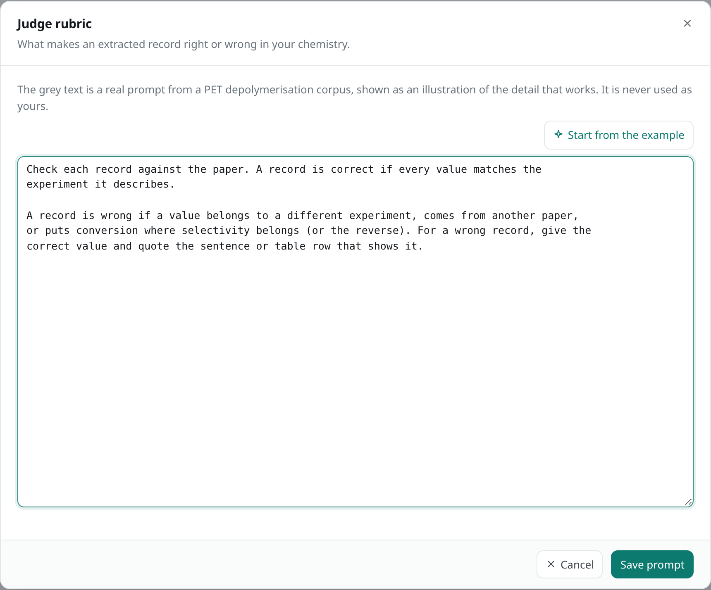

# Judge rubric

Language models make mistakes: a value from the wrong row, a number from another paper,
conversion in the selectivity field. So a second pass, the **judge**, reads each paper again
and checks every record against it. The **rubric** tells the judge what makes a record right
or wrong.

For the example papers, use this rubric:

```text title="rubric.txt"
Check each record against the paper. A record is correct if every value
matches the experiment it describes.

A record is wrong if a value belongs to a different experiment, comes
from another paper, or puts conversion where selectivity belongs (or the
reverse). For a wrong record, give the correct value and quote the
sentence or table row that shows it.
```

## Set the rubric

=== "Browser"

    1. Click **Judge** at the top of the page.
    2. Next to **Judge rubric**, click **Write**.
    3. Paste the rubric into the box, and click **Save prompt**.

    !!! success "You should see"
        

=== "Python"

    Save the rubric as `rubric.txt` next to your script, and load it:

    ```python
    from pathlib import Path

    project.rubric = Path("rubric.txt")
    ```

!!! tip "A good rubric"
    Say what makes a record correct, then list the mistakes you expect in your field. Ask
    for the corrected value and a quote, so you can check the judge too.

!!! info "The judge suggests, you decide"
    The judge never changes a record. It marks each one correct or incorrect, explains why,
    and suggests corrected values. You accept or reject them when you [review](../run/review.md).

That's everything set up. Continue with [Choose papers](../run/choose.md).
