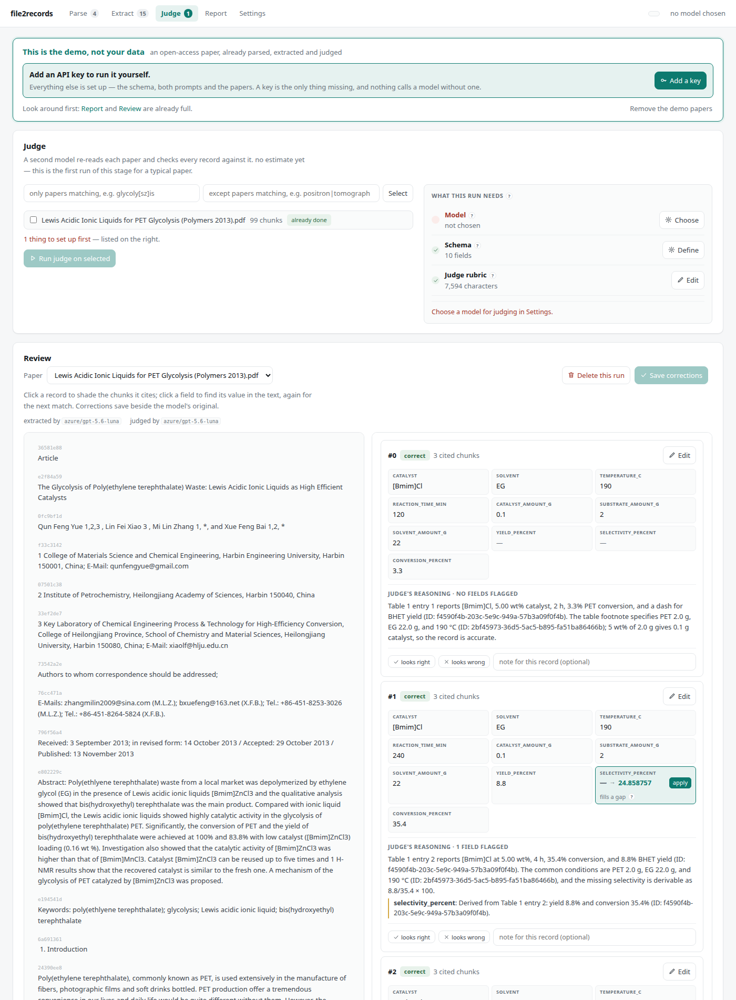

# Review and export

## Review

```bash
file2records serve my-review
```

Open **Judge** and pick a paper. The paper is on the left, its records on the right.

- **Click a record** to shade the chunks it cites.
- **Click a field** to find its value in the text; click again for the next match.
- **Edit** any value, or press **apply** on the judge's proposed fix.
- Mark a record **looks right** / **looks wrong** and add a note.

Corrections are saved beside the model's original output, so the two can always be compared.



## Export

=== "Browser"

    Report page → **Records CSV**, **Records JSON** or **Full bundle**. The two boxes above the
    cards limit the export to papers matching a regex.

=== "Command line"

    ```bash
    file2records export my-review dataset.csv
    file2records export my-review dataset.zip --only "glycoly[sz]is"
    ```

=== "Python"

    ```python
    project.export("dataset.csv")
    rows = project.records()          # the same rows as a list of dicts
    ```

Every row has the paper's `doi` and `title`, the extracted fields, `source_chunk_ids`, the
judge's verdict, reasoning and proposed fixes, your flag and note, and which models produced it.

The **bundle** (`.zip`) adds what produced the data: the schema, both prompts, the worked
examples, model settings (never keys), per-paper cost, and a manifest with the file2records
version.

## Sharing a dataset

!!! warning "Paper text is left out of the bundle unless you ask"
    Papers from a publisher's text-and-data-mining agreement (Elsevier, Wiley, Springer…) may
    be mined, not redistributed. The bundle therefore carries each record's DOI and chunk ids,
    not the text. Add the text only if every paper is open access: tick *bundle includes paper
    text* in the browser, or `--include-text`.

Extracted values themselves are facts and can be shared; cite the papers by DOI.
