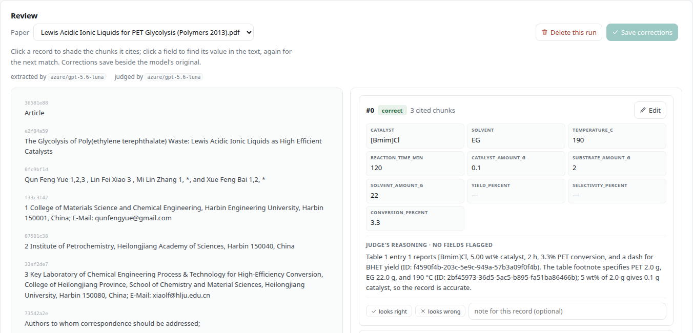

# file2records

file2records builds a dataset from a folder of scientific papers. You say which fields a
record has. A language model reads each paper and fills them in, a second model checks every
record against the paper, and you review the result with the source passage next to each
value.

It reads PDF, JATS XML, Elsevier XML, HTML and Word files, runs on your own machine, and
comes set up for RWTH's KI:connect models, which are free for RWTH members.



## Install

=== "pip"

    ```bash
    pip install "file2records[pdf]"
    ```

=== "uv"

    ```bash
    uv add "file2records[pdf]"
    ```

The `[pdf]` part installs docling, which reads PDFs and needs PyTorch, a download of a few GB.
If your papers are XML, HTML or Word files, `pip install file2records` is enough and takes
about 350 MB.

## Try it

```bash
file2records serve
```

This opens your browser on a finished example: an open-access paper on PET glycolysis that
has already been read, extracted, and checked. Open **Judge** to see each record beside the
passage it came from, and **Report** for the whole dataset. You don't need a key to look
around.

## Use it from the browser, the command line, or Python

=== "Browser"

    ```bash
    file2records serve my-review
    ```

    Add papers, define the fields and the prompt, and press **Extract**. Each page lists what
    it still needs before it can run.

=== "Command line"

    ```console
    $ file2records add my-review papers/
    Reading into my-review
      ✓ PMC12587479.xml  [jats]  64 chunks  doi:10.1039/d5ra05618g
      ✓ PMC13589335.xml  [jats]  84 chunks  doi:10.1186/s12880-026-02772-8
      ✓ PMC8877978.xml  [jats]  46 chunks  doi:10.3390/polym14040656
    3 added, 0 failed

    $ file2records extract my-review
    $ file2records export my-review dataset.csv
    ```

=== "Python"

    ```python
    import file2records as fr

    project = fr.Project("my-review")
    project.add("papers/")
    project.extract()
    project.export("dataset.csv")
    ```

All three work on the same project folder. You can run the extraction from a script and
review it in the browser afterwards.

The command line and Python read your AI service's endpoint, your key, and the model name
from a `.env` file. See [Set up API access](how-to/connect.md).

## Next steps

1. [Set up API access](how-to/connect.md) to a language model: an endpoint, a key, and a
   model name. [Example: RWTH KI:connect](examples/rwth-kiconnect.md) shows it step by step.
2. [Get started](tutorial.md): build a small dataset from three real catalysis papers, step by
   step in the browser, in about 15 minutes.
