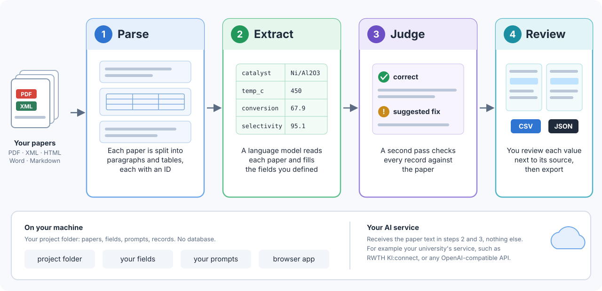

# file2records

file2records builds a dataset from a folder of scientific papers. You say which fields a
record has. A language model reads each paper and fills them in, a second pass checks every
record against the paper, and you review the result with the source passage next to each
value.



It reads PDF, JATS XML, Elsevier XML, HTML, and Word files, and works with any
OpenAI-compatible AI service, such as your university's. Everything stays on your computer
except the paper text sent to that service.

## Install

```bash
pip install file2records
```

To read PDF files too, install `"file2records[pdf]"` instead. See
[Install file2records](get-started/install.md).

## Look at a finished example

```bash
file2records serve
```

Your browser opens on a finished example: an open-access paper on PET glycolysis that has
already been parsed, extracted, and judged. Open **Judge** to see each record beside the
passage it came from, and **Report** for the whole dataset. You don't need an API key to look
around.

## Use it from the browser or from Python

Both work on the same project folder, and you can switch between them at any time.

=== "Browser"

    ```bash
    file2records serve my-project
    ```

    Add papers, define the fields, write the prompt, and click **Extract**. Each page lists
    what it still needs.

=== "Python"

    ```python
    import file2records as fr

    project = fr.Project("my-project")
    project.add("papers")
    project.schema = Experiment          # your fields, as a class
    project.prompt = "Extract every ..."
    project.extract()
    project.export("dataset.csv")
    ```

## Next steps

[Get started](get-started/index.md) walks you through the whole pipeline once, step by step,
with three real papers on CO₂ hydrogenation catalysts. It takes about 20 minutes.
