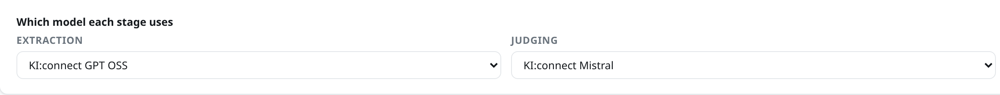

# Extraction and judge models

file2records uses a language model twice: once to **extract** records from each paper, and
once to **judge** them. You can use the same model for both, or a different one for the
judge so that it isn't checking its own work.

## Choose a model

Your AI service lists its models, often with details for each. Look for three things:

Message limits
:   You send one message per paper for extraction, and one more for judging. A model
    without a message limit is best.

Where the data is processed
:   For papers that aren't public yet, choose a model that processes data in your country
    or at your institution.

Maximum output
:   How much the model can write in one answer. A paper with a very large table needs a
    model that can write a long answer.

!!! tip "Any spelling of the name works"
    Services often spell one model differently on different pages. KI:connect calls one
    model "Mistral Small 4 119b" in its chat menu, `mistral-small-4-119b-2603` on its
    overview page, and `mistralai-mistral-small-4-119b` in its API. file2records accepts any
    of these, and part of the name too, such as `mistral`.

## Set the models

=== "Browser"

    1. Run `file2records serve my-project`, and click **Settings** at the top of the page.
    2. Under **Models**, click **Add a model**, and type a name, such as `My AI service`.
    3. Paste your endpoint into **Endpoint** and your key into **API key**.
    4. Click **List models**. file2records asks your service which models it has:

        

    5. Click the model you want, and click **Save changes** at the bottom of the page.
    6. Click **Test connection**.

        !!! success "You should see"
            

    With one model, it's used for both stages. To judge with a different model, add a
    second one the same way, and choose it under **Which model each stage uses**:

    

=== "Python"

    Add the model's name to the `.env` file from the
    [previous step](api-key.md):

    ```bash title=".env"
    FILE2RECORDS_ENDPOINT=https://chat.kiconnect.nrw/api/v1
    FILE2RECORDS_API_KEY=paste-your-key-here
    FILE2RECORDS_MODEL=gpt-oss-120b
    ```

    To judge with a different model, add one more line:

    ```bash title=".env"
    FILE2RECORDS_JUDGE_MODEL=mistral
    ```

    Then create a project and check that the model works:

    ```python
    import file2records as fr

    project = fr.Project("my-project")

    for problem in project.check():
        print("-", problem)
    ```

    !!! success "You should see"
        ```console
        - Define the fields a record has: Settings → Schema in the browser, or project.schema in Python.
        - Write the extraction prompt: on the Extract page in the browser, or project.prompt in Python.
        ```

        The model isn't in the list, so it works. The fields and the prompt come in
        [Define what to extract](../define/fields.md).

    ??? note "If the key or the model is wrong"
        `check` asks your service for its models, so a problem shows up here, for example:

        ```console
        - https://chat.kiconnect.nrw/api/v1 rejected the API key (HTTP 401). Check that the key is complete and belongs to this service.
        - "llama" is not one of the models this service offers: mistralai-mistral-small-4-119b, Qwen 3.8 27B, gpt-oss-120b, ...
        ```

## A project

These steps create a **project**: a folder, here `my-project`, that holds
everything for one dataset. That's your papers, fields, prompts, records, and, from the
browser, your model settings. The browser and Python use the same folder, so you can start
in one and continue in the other.

Continue with [Papers and the parser](papers.md).
