# Tutorial: your first dataset

In this tutorial you build a small dataset from three real papers on CO₂ hydrogenation
catalysts. You do every step in your web browser, and each step shows what you should see.
It takes about 20 minutes.

The example AI service is RWTH Aachen's KI:connect. If your organization runs a different
service, the steps are the same: you need an endpoint, an API key, and the name of a model.

## What you need

- A computer with Python 3.10 or later. To check, open a terminal and run
  `python --version`.
- An account with an AI service that offers an API. Many universities run one, and your IT
  center can tell you whether yours does.

## 1. Install file2records

Open a terminal and run:

```bash
pip install file2records
```

To check that it worked, run:

```console
$ file2records --version
file2records 0.2.1
```

## 2. Get your endpoint and API key

Open your AI service's API key page. On KI:connect, log in at
[chat.kiconnect.nrw](https://chat.kiconnect.nrw), click your name in the bottom-left corner,
and click **API Keys Management**.

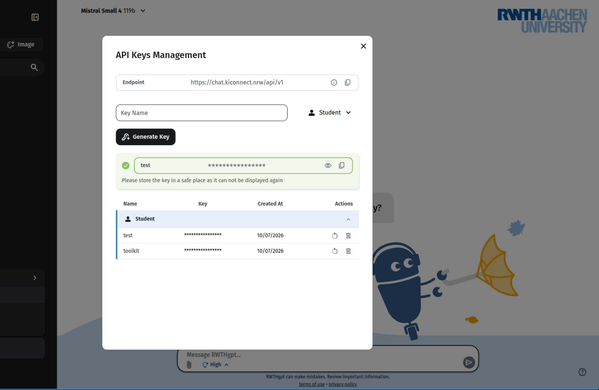

1. Next to **Endpoint**, click the copy icon. Paste the endpoint into a text file. On
   KI:connect it's `https://chat.kiconnect.nrw/api/v1`.
2. In **Key Name**, type `file2records`, and click **Generate Key**.
3. Next to your new key, click the copy icon, and paste the key into the same text file.

!!! warning "Copy the key now"
    The service shows the key only once. If you lose it, delete it and generate a new one.

Other services have a similar page, often called **API**, **API keys**, or **Developer**.
You always need the same two things from it: the endpoint and the key.

## 3. Choose a model

Your service offers several models. On KI:connect, open the model menu at the top of the
chat page:

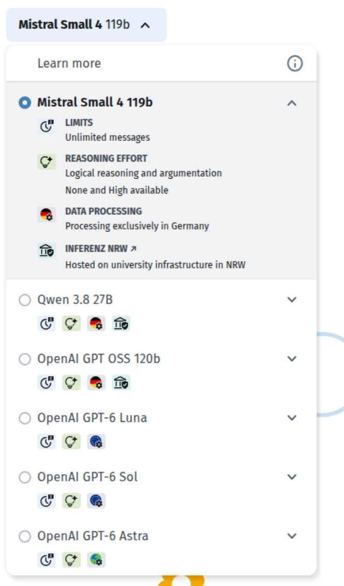{ width="360" }

Click **Learn more** at the top of the menu to see the details of every model:

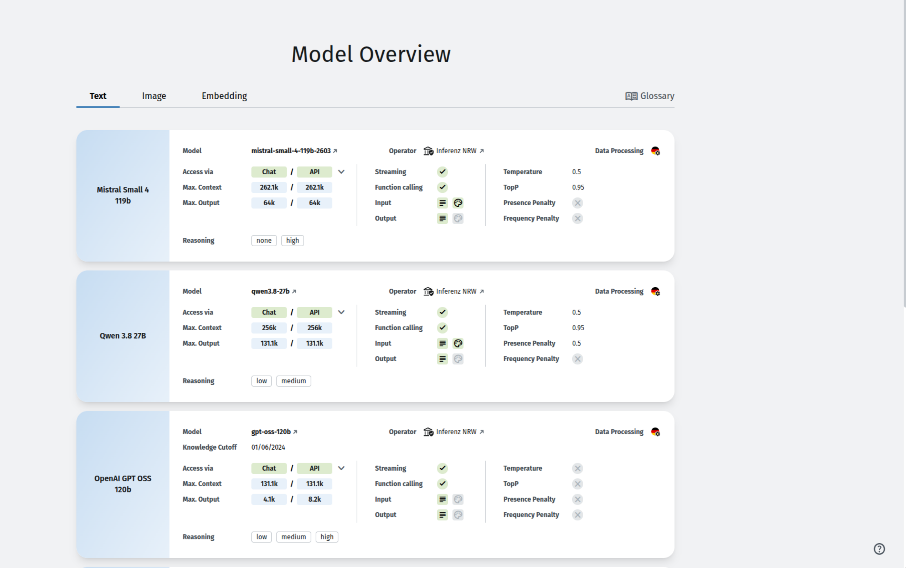

Look at three things:

Limits
:   You send one message per paper, and two if you also check the results. A model with
    **Unlimited messages** is best.

Data processing
:   A German flag means the data stays in Germany. Choose one of these if your papers
    aren't public yet.

Max. output
:   How much the model can write in one answer, in the **API** column. Each record takes some
    of it. A paper with a very large table needs a model with a large maximum output.

On KI:connect, use **OpenAI GPT OSS 120b**. It has unlimited messages, stays in Germany, and
gave the best results of KI:connect's models in a benchmark on chemistry papers. Write its name into your text file.

You don't need to copy the name exactly. The service spells each model differently on each
page, and file2records shows you the correct spelling in step 5.

## 4. Open file2records

In the terminal, run:

```bash
file2records serve my-project
```

Your browser opens on a new, empty project called `my-project`. The **Getting started** box
lists what's still missing:

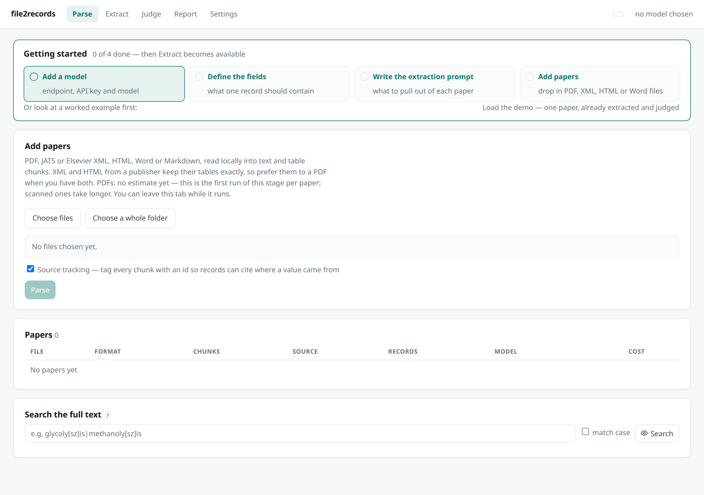

Leave the terminal open while you work. To stop file2records later, press ++ctrl+c++ in the
terminal.

## 5. Connect the model

1. Click **Settings** at the top of the page.
2. Under **Models**, click **Add a model**.
3. Type a name, such as `My AI service`.
4. Paste your endpoint into **Endpoint** and your key into **API key**.
5. Click **List models**. file2records asks your service which models it has and shows them:

    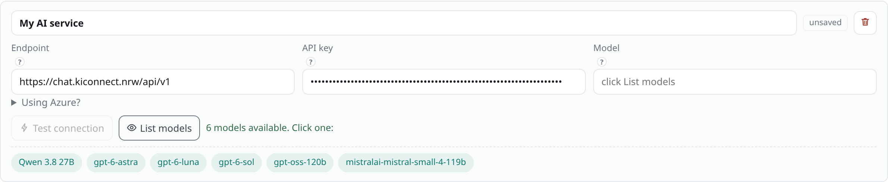

6. Click the model you chose in step 3. On KI:connect, that's `gpt-oss-120b`.
7. At the bottom of the page, click **Save changes**.
8. Click **Test connection**. After a few seconds you see **It works**:

    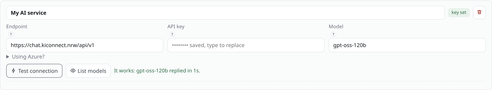

## 6. Say what one record is

A record is one experiment. You decide which values it has. Each value is a field with a
name, a type, and a description. The model reads the descriptions, so put the unit there.

1. Still in **Settings**, scroll to **Schema**, and click **Clear all**.
2. Click **Add field** six times, and fill in the rows:

    <!-- vale Google.Latin = NO -->
    | Field name | Type | Description |
    |---|---|---|
    | `catalyst` | string | Catalyst as the paper names it, e.g. 5Ni5Zn/SiO2 |
    | `temperature_c` | number | Reaction temperature in °C |
    | `pressure_bar` | number | Total pressure in bar; convert MPa by multiplying by 10 |
    | `co2_conversion_percent` | number | CO2 conversion, % |
    | `main_product` | string | Main product, e.g. CO, CH4, methanol |
    | `selectivity_percent` | number | Selectivity to the main product, % |
    <!-- vale Google.Latin = YES -->

3. Click **Save changes**.

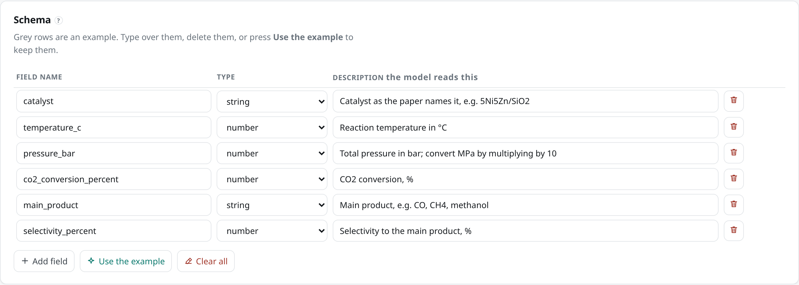

## 7. Add the papers

Download three open-access papers from Europe PMC. In the terminal, run:

```bash
mkdir papers
curl -o papers/PMC13614198.xml https://www.ebi.ac.uk/europepmc/webservices/rest/PMC13614198/fullTextXML
curl -o papers/PMC13631360.xml https://www.ebi.ac.uk/europepmc/webservices/rest/PMC13631360/fullTextXML
curl -o papers/PMC12631322.xml https://www.ebi.ac.uk/europepmc/webservices/rest/PMC12631322/fullTextXML
```

On Windows, type `curl.exe` instead of `curl`. If you have papers of your own, as PDF, XML,
HTML or Word files, you can use those instead.

Then, in the browser:

1. Click **Parse** at the top of the page.
2. Click **Choose files** and select the three files in the `papers` folder.
3. Click **Parse 3 files**.

After a few seconds the papers appear in the list, each with its DOI:

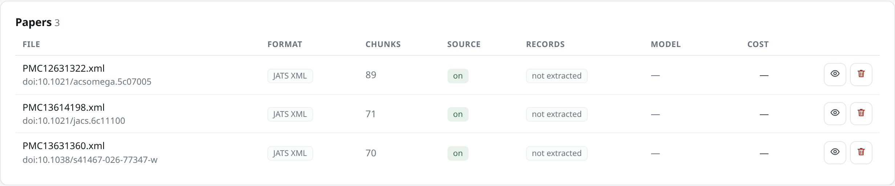

## 8. Write the extraction prompt

The prompt tells the model what to extract and what to skip.

1. Click **Extract** at the top of the page.
2. Next to **Extraction prompt**, click **Write**.
3. Copy this text into the box:

    ```text
    Extract every CO2 hydrogenation experiment this paper reports. One record per catalyst and
    reaction condition; each row of a results table is one record.

    Skip values quoted from other papers, values shown only in figures, and theoretical
    calculations. Conditions stated once for a whole table apply to every row of it.

    If the paper doesn't report a value, use null. Never use 0 for a missing value.
    Conversion and selectivity are different fields; never put one in the other.
    ```

4. Click **Save prompt**.

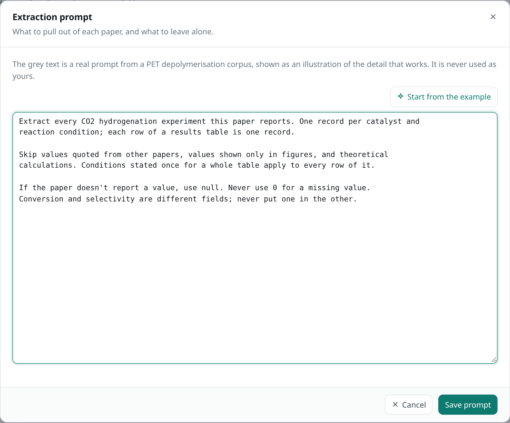

## 9. Extract the records

On the **Extract** page, all three papers are ticked, and every item under **What this run
needs** has a green check:

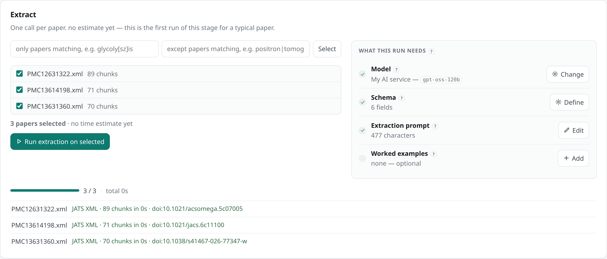

Click **Run extraction on selected**. Each paper takes between a few seconds and a minute.
When it's done, each paper shows how many records it gave:

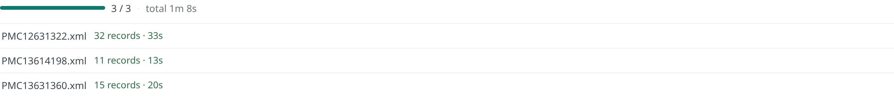

## 10. Check the records

A second pass with the model checks every record against the paper.

1. Click **Judge** at the top of the page.
2. Next to **Judge rubric**, click **Write**, copy this text into the box, and click
   **Save prompt**:

    ```text
    Check each record against the paper. A record is correct if every value matches the
    experiment it describes.

    A record is wrong if a value belongs to a different experiment, comes from another paper,
    or puts conversion where selectivity belongs (or the reverse). For a wrong record, give the
    correct value and quote the sentence or table row that shows it.
    ```

3. Click **Run judge on selected**.

When it's done, the **Review** section shows a paper on the left and its records on the
right. Each record says **correct** or **incorrect**, with the reason underneath:

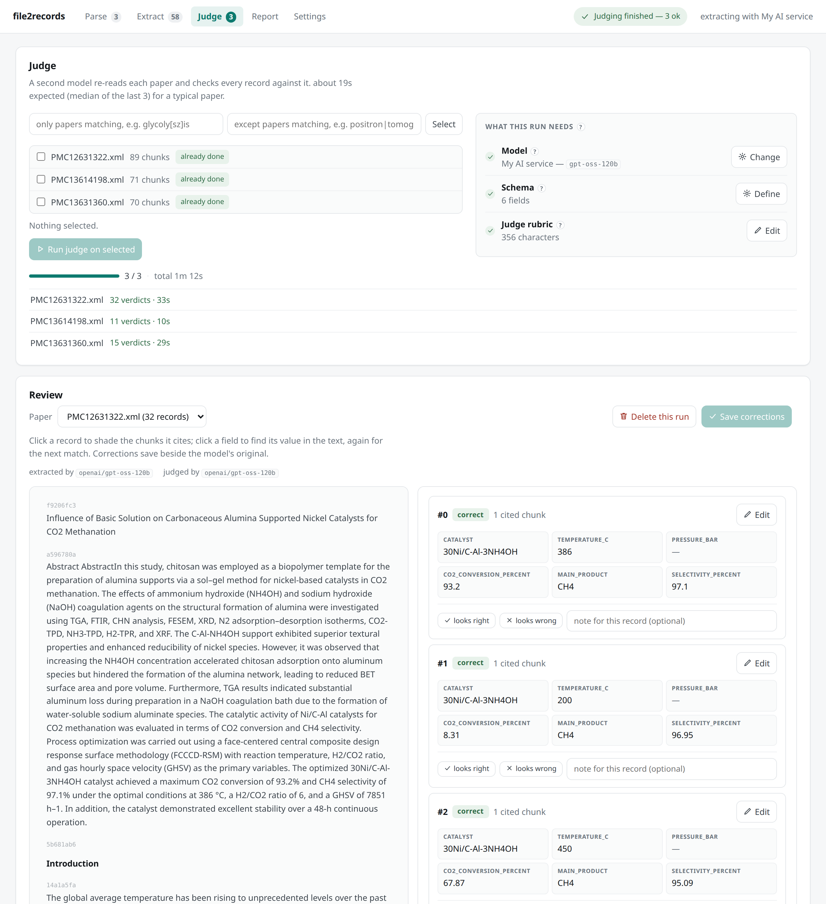

- Click a record to highlight the passages it came from.
- If the judge suggests a different value, the field shows it with an **apply** button.
  Nothing changes until you click it.
- To change a value yourself, click **Edit** on the record. Then click **Save corrections**.

## 11. Export the dataset

Click **Report** at the top of the page, then **Records CSV**:

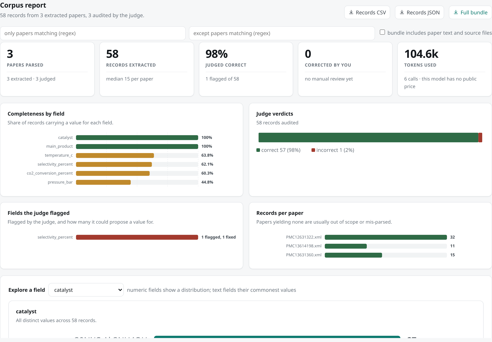

The CSV file opens in Excel or any spreadsheet program. It has one row per record, with the
paper's DOI, the judge's verdict and reasoning, and the model that produced it.

## If something goes wrong

| What you see | What to do |
|---|---|
| `file2records: command not found` | Close the terminal, open a new one, and try again. If it still fails, run `python -m file2records` instead of `file2records`. |
| "rejected the API key" | Copy the key again. Include every character, including anything after a colon. |
| "answered HTTP 404" | The endpoint is the website address, not the API address. On KI:connect it's `https://chat.kiconnect.nrw/api/v1`. |
| A paper says "did not match the schema" | The answer was too long for the model. Choose a model with a larger maximum output for that paper. |
| A paper gives 0 records | The paper doesn't report any experiments your prompt asks for, such as a review article. That's expected. |

## Next steps

- To work with your own papers, start again at step 4 with a new project name, and change
  the fields and the prompt to fit your chemistry.
  [Write the schema and prompts](how-to/schema-and-prompts.md) explains what makes a good
  prompt.
- To run extraction from a script or the command line instead of the browser, see
  [Run it from a script](how-to/script.md).
